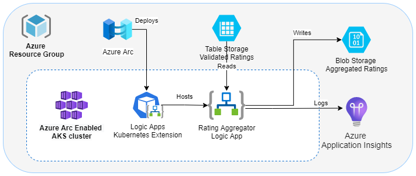

# Introduction

This sample shows an Azure Logic App running on an Arc-enabled Kubernetes cluster. The Logic App periodically checks Azure Table Storage for new ratings items. Any new ratings are appended to a JSON file in Azure Blob Storage that contain all the ratings for that product.



## Deploy to Azure

1. Open the `arc-enabled-logic-app-sample` folder in VS Code.
1. Re-open the window in a dev container. You'll need Docker and the [Remote Development Extension](https://marketplace.visualstudio.com/items?itemName=ms-vscode-remote.vscode-remote-extensionpack) installed. This container has all the tools and cli extensions you'll need preinstalled. If you can't open the dev container, check ./devcontainer/Dockerfile for the prerequisites.

1. Log into your Azure subscription using `az login`.
1. Change directory to `arc-enabled-logic-app-sample/env`.
1. To enable the necessary resource providers in your subscription run

    ```bash
    ./deployFeatureRegister.sh
    ```

1. Open `environment-variables.sh` and provide a value for the basename variable. This will be used to generate names for other resources.
1. Run `source environment-variables.sh` in your terminal to load the values. The script will test if the name of the storage account is valid, and output "Storage name is not valid" if not. The result is in the `STORAGE_NAME_VALID` variable. Pick a different, unique name for resource group if this value is `false`, and try again, unless you plan to re-use the existing storage account.
1. Create a compliant AKS cluster with a public static IP address, Arc connection, and App Service Arc extensions.

    ```bash
    source ./provisionKubernetesHostInfra.sh
    ```

1. Provision the App service components, and deploy the logic app.

   ```bash
   source ./deploy.sh
   ```

The script will output the portal url of the Logic App and the Storage Account. The deployment script will also populate the *ratings* table with an initial value. You can view the resulting logic app runs and resulting data in the *ratings* table and blob containers using these urls.

## Testing in Azure

Once the app is deployed to Azure, you can upload data to *ratings* table in Azure Table Storage, and view the results in Azure Blob Storage.

1. Use the [Azure Storage Explorer](https://azure.microsoft.com/features/storage-explorer/) to connect to the storage account output by the deploy script.
   > Check the `deploy.sh1` file for an example on using the azure cli to interact with table storage if you can't use Azure Storage Explorer.
1. Open the ratings table.
1. Click the `Import` button
1. Import the `ratings.csv` file in the `data` folder of the workspace.
1. Open the Logic app in the portal using the URL ouptut by the deployment script.
1. Open the `RatingsWorfklow` workflow.
1. Wait until a new run is completed.
1. Open the run and view the results.
1. Refresh the ratings table in the Azure Storage Explorer. The ratings' `publishDate` field should now be set to the time the workflow ran.
1. Open the `ratings` blob container in the same storage account.
1. Open the blob called 3. This blob will contain the ratings from the ratings table.

Try adding more data with different product ID's in the ratings table, or change the publish date of an existing item to `00/00/0000`, to add it to the blobs.
