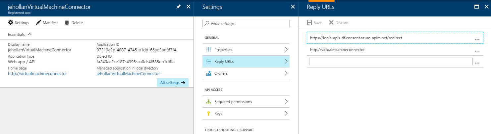

# Microsoft Graph Connector

This is a logic app custom connector for a few operations on the Microsoft Graph.  It provides the following actions:

|Action|Description|
|--|--|
|AddUser|Add a user into the graph|
|AssignManager|Assign a manager to a user|
|AssignLicense|Assign a license to a user|
|ListPlansGroup|List all plans in a group|

## Pre-Requisites

This connector does require authentication to Azure Active Directory.  As such, deployment will require the client ID and client Secret for an AAD Application.  You'll need to a register an Azure Active Directory application with **User + app access** so the connector can act on-behalf-of the authenticated user.  Be sure to give your application delegate permissions to the Microsoft Graph.

After deploying, you will need to open the connector (named `microsoft-graph-connector` in whichever resource group and location selected) and copy the redirect URL from the security tab.  Update your Azure AD Application reply URLs to support the logic app consent flow.

## Deploying

You can deploy with the [azuredeploy.json](azuredeploy.json) or by clicking the button below:

After deployment you can view the connector `Microsoft Graph` in any of the logic apps in the region you deployed the connector to.  You can deploy this connector to as many regions as you require.