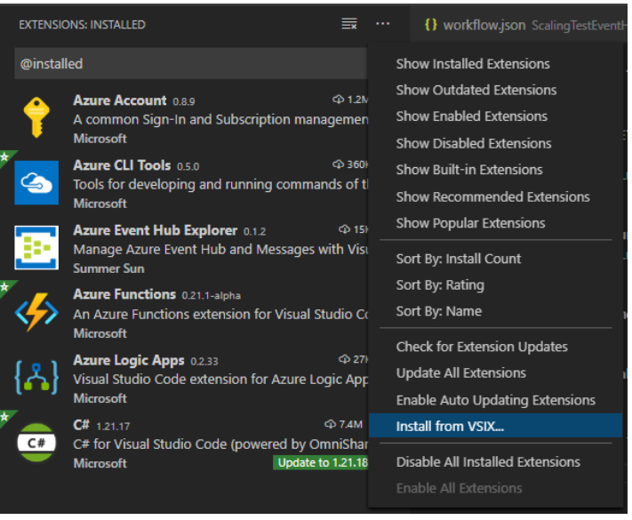
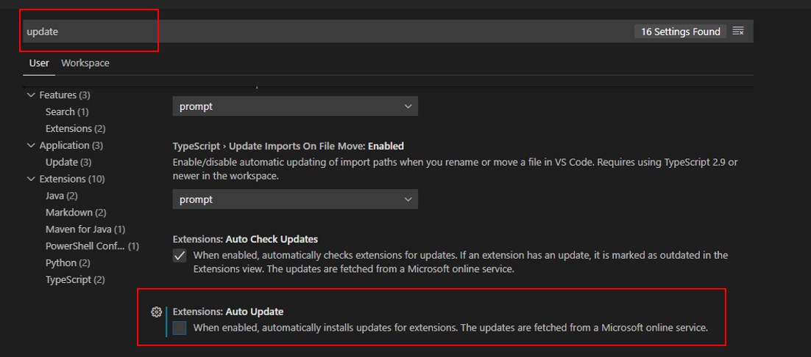
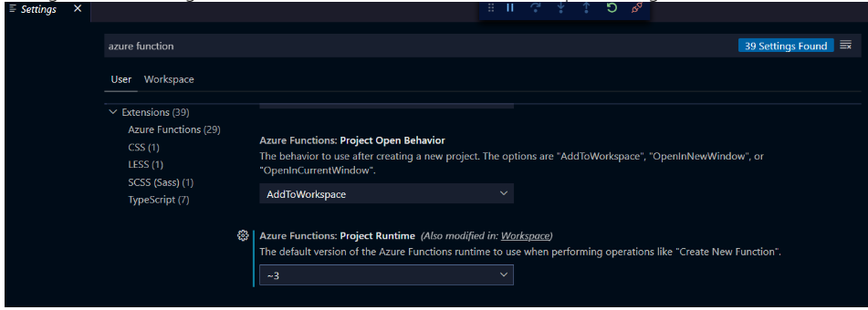

# 2. Set up your development environment

If you find any issues when running through this set up, or when using the tools, please make sure you [raise an issue](https://github.com/Azure/logicapps/issues/new).

1. Install the latest Azure Functions core tools from these locations: Note: If you previously installed the Azure Functions core tools, please uninstall them first or make sure that the PATH environment variable points to the specific version here :

> win-x64 (MSI): functionscdn.azureedge.net/public/3.0.2569/func-cli-3.0.2569-x64.msi
>
> win-x86 (MSI): functionscdn.azureedge.net/public/3.0.2569/func-cli-3.0.2569-x86.msi

2. In Visual Studio Code, install the preview version of the extension from the [Readme with link to latest version](https://github.com/Azure/logicapps/blob/master/preview/readme.md), which you can install as a VSIX file. On the extensions list toolbar, select the ellipses (…), and select Install from VSIX. Note: This version will replace any existing Azure Functions extension but preserves the capability to author Azure Functions.

3. If you haven't already done so, install the [C# extension for Visual Studio Code](https://marketplace.visualstudio.com/items?itemName=ms-dotnettools.csharp). This extension enables F5 functionality to run the workflow.

4. Disable auto-update for Visual Studio Code extensions by going to the settings page. (Press Ctrl+,) This action prevents the possibility that this private preview extension is overwritten by the public extension when you restart Visual Studio Code.

5. Reload Visual Studio Code so that the extensions are correctly installed. Also, you can close and reopen Visual Studio Code.

6. Change the Visual Studio Code settings to use the Azure Functions project runtime Version 3. To open the settings, press Ctrl +.

7. If you don't have the standalone Azure Storage Emulator, download and install the emulator first. If you haven't previously used the emulator, you must initialize the emulator before you can start. This will also need you to have a local SQL DB, e.g. SQL Express, installed for Storage Emulator to use.

8. If you have a previous version of the extension bundle, clean up any existing bundle binaries in the following location:

> %TEMP%\Functions\ExtensionBundles\Microsoft.Azure.Functions.ExtensionBundle.Workflows*

9. For deployment to Azure, please make sure you can browse your app at the [preview URL](https://portal.azure.com/?websitesextension_workflowspreview=true)