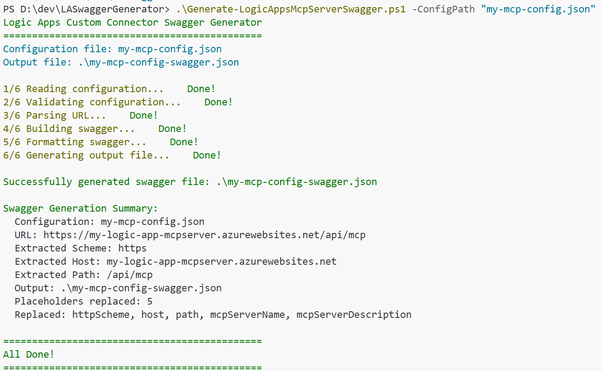

# Logic Apps MCP Server Swagger Generator

This utility generates swagger file for your Logic Apps Custom Connectors that serve as MCP (Model Context Protocol) servers in Microsoft Azure. This enables AI agents such as [Logic Apps Agent Loop](https://techcommunity.microsoft.com/blog/integrationsonazureblog/%F0%9F%93%A2announcing-agent-loop-build-ai-agents-in-azure-logic-apps-%F0%9F%A4%96/4415052) to access custom tools and integrations.

## Overview

The **[Generate-LogicAppsMcpServerSwagger.ps1](Generate-LogicAppsMcpServerSwagger.ps1)** script reads a JSON configuration file and applies the values to an inline swagger template, generating a complete OpenAPI specification that can be imported into a Custom Connector. This connector can then serve as an MCP server, providing tools and capabilities to AI agents in your Logic Apps workflows.

### 1. Quick Start 🚀

1. **Download** the [Generate-LogicAppsMcpServerSwagger.ps1](Generate-LogicAppsMcpServerSwagger.ps1) script
1. **Create** a configuration file with your MCP server details
1. **Run** the script to generate your swagger file
1. **Import** the swagger into Azure Logic Apps Custom Connector to create MCP Server.

### 2. Setup 🔧

1. Download the [`Generate-LogicAppsMcpServerSwagger.ps1`](Generate-LogicAppsMcpServerSwagger.ps1) script
2. Save it to your desired directory
3. Ensure PowerShell execution policy allows running scripts:

   ```powershell
   Set-ExecutionPolicy -ExecutionPolicy RemoteSigned -Scope CurrentUser

### 3. Configuration ⚙️

#### 3.1. Creating a Configuration File

Either download the file [`my-mcp-config.json`](my-mcp-config.json) and update it or create your own JSON configuration file with the following required fields:

```json
{
    "url": "https://yourserver.azurewebsites.net/api/mcp",
    "mcpServerName": "Your MCP Server Name",
    "mcpServerDescription": "Detailed description of your MCP server functionality"
}
```

#### 3.2. Configuration Fields ⚙️

| Field | Required | Description | Example |
|-------|----------|-------------|---------|
| url | ✅ | The MCP server url. | "<https://yourserver.azurewebsites.net/api/mcp>"
| mcpServerName | ✅ | Display name for your MCP server (shown in Logic Apps Designer) | `"Customer Service MCP Server"` |
| mcpServerDescription | ✅ | Detailed description of server capabilities and purpose | `"Provides customer service data access and analytics tools for AI agents"` |

#### 3.3. Sample Configuration Files

##### Example 1: Customer Service MCP Server

```json
{
    "url": "https://customer-service-mcp.azurewebsites.net/api/servers/customertools/mcp",
    "mcpServerName": "Customer Service MCP Server",
    "mcpServerDescription": "Provides customer lookup, ticket management, and support analytics tools for AI agents handling customer service workflows."
}
```

##### Example 2: Data Analytics MCP Server

```json
{
    "url": "https://analytics-mcp-prod.azurewebsites.net/api/mcp",
    "mcpServerName": "Business Intelligence MCP Server", 
    "mcpServerDescription": "Offers data visualization, reporting, and business intelligence tools that enable AI agents to generate insights from enterprise data sources."
}
```

### 4. Usage 📖

#### 4.1. Basic usage 📘

Specify config file:

```powershell
.\Generate-LogicAppsMcpServerSwagger.ps1 -ConfigPath "my-mcp-config.json"
```

Specify config and custom output file:

```powershell
.\Generate-LogicAppsMcpServerSwagger.ps1 -ConfigPath "my-mcp-config.json" -OutputPath "custom-swagger.json"
```

Specify config, custom output file, and verbose for advanced telemetry:

```powershell
.\Generate-LogicAppsMcpServerSwagger.ps1 -ConfigPath "my-mcp-config.json" -OutputPath "custom-swagger.json" -Verbose
```

#### 4.2. Parameters 🧩

| Parameter | Required | Description |
|-----------|----------|-------------|
| -ConfigPath | ✅ | Path to your JSON configuration file |
| -OutputPath | ❌ | Custom output path (defaults to `{config-name}-swagger.json`) |
| -Verbose | ❌ | Show detailed replacement information |

#### 4.3. Sample Script Execution 💻

Here's what you'll see when running the script successfully:


#### 4.4. Generated Swagger Structure 📄

See the file [`my-mcp-config-swagger.json`](my-mcp-config-swagger.json) for reference.

### 5. Using the Generated Swagger in Azure

1. **Open** [Azure portal](https://portal.azure.com)
2. **Create Logic Apps Custom Connector** of kind "mcpServer".
3. **Go to Custom Connector** that you just created.
4. **Click "Edit"** and set the "Import mode" to "OpenAPI file".
5. **Upload your generated swagger file** and click Import.
6. **Configure authentication** if needed (API Key, OAuth, Basic, None etc.)
7. **Click on Update Connector**. Ensure it is saved successfully.
8. **Refer to official docs** on how to use this MCP server in your AI Agent.

### 6. Troubleshooting Common Issues 🩺

#### 6.1. Config File Not Found

```
Configuration file not found: my-config.json
```

**Solution**: Verify the file path and ensure the file exists

#### 6.2. Missing Required Fields

```
Missing or empty required configuration fields: url, mcpServerName
Required fields: url, mcpServerName, mcpServerDescription
```

**Solution**: Add all required fields to your configuration file

#### 6.3. Invalid JSON

```
Failed to read or parse JSON file 'config.json': Invalid JSON
```

**Solution**: Validate your JSON syntax using a JSON validator

#### 6.4. Placeholder Not Replaced

```
WARNING: Placeholder '${customField}' not found in template
```

**Solution**: Only use the four supported placeholder fields in your config

### 7. Getting Help 💬

- Check the verbose output: Add `-Verbose` to your powershell command execution to see detailed processing.
- Validate your JSON: Use online JSON validators
- Review the generated swagger: Ensure all **${placeholders}** were replaced
- Test incrementally: Start with a minimal config and add complexity

### 8. License ⚖️

This script is provided under the MIT License. See [LICENSE](../../LICENSE) file for details.

### 9. Contributing 🤝

Contributions are welcome! Please feel free to submit issues, feature requests, or pull requests to improve this tool.

This tool simplifies the process of swagger generation for creating MCP servers usinc Custom Connectors for Azure Logic Apps, enabling powerful AI agent integrations with your business systems and workflows.
